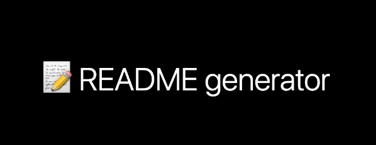

<div id="top"><div>
<!--
*** This is the Readme for the readme generator 
-->

<!-- Project Shields -->

[![LinkedIn][linkedin-shield]][linkedin-url]

[](https://opensource.org/licenses/MIT)

<!-- Project Logo -->
<br />
<div align="center">
    <a href="https://github.com/aaguirre7/the_readme_I_completed">
        
    <a/>
    <h3 align="center">
        A README.md Generator
    </h3>
    <p align="center">
        Quick and dirty README generator
        <br />
        <a href="https://github.com/aaguirre7/the_readme_I_completed">
            <strong>Explore the docs</strong>
        </a>
        <br />
        <br />
</div>

<!-- TABLE OF CONTENTS -->
<details>
  <summary>Table of Contents</summary>
  <ol>
    <li>
      <a href="#about-the-project">About The Project</a>
    </li>
    <li>
        <a href="#what-was-done"> What was done</a>
    </li>
    <li>
        <a href="#instalation"> instalation</a>
    </li>
    <li>
        <a href="#usage"> usage</a>
    </li>
    <li>
        <a href="#contact">Contact</a>
    </li>

  </ol>
</details>

<!-- ABOUT THE PROJECT -->
## About The Challange

[![Product Name Screen Shot][product-screenshot]](./assets/images/screenshot_1.png)
[![Product Name Screen Shot][product-screenshot]](./assets/images/screenshot_2.png)
### The Task

AS A developer
I WANT a README generator
SO THAT I can quickly create a professional README for a new project

### Criteria

- GIVEN a command-line application that accepts user input
- WHEN I am prompted for information about my application repository
THEN a high-quality, professional README.md is generated with the title of my project and sections entitled Description, Table of Contents, Installation, Usage, License, Contributing, Tests, and Questions
- WHEN I enter my project title
THEN this is displayed as the title of the README
- WHEN I enter a description, installation instructions, usage information, contribution guidelines, and test instructions
THEN this information is added to the sections of the README entitled Description, Installation, Usage, Contributing, and Tests
- WHEN I choose a license for my application from a list of options
THEN a badge for that license is added near the top of the README and a notice is added to the section of the README entitled License that explains which license the application is covered under
- WHEN I enter my GitHub username
THEN this is added to the section of the README entitled Questions, with a link to my GitHub profile
- WHEN I enter my email address
THEN this is added to the section of the README entitled Questions, with instructions on how to reach me with additional questions
- WHEN I click on the links in the Table of Contents
THEN I am taken to the corresponding section of the README

### What was done

a README generator was cvreated using JavaScript and NODEjs.
The Inquirer module was used and this runs directly from your locel computer. it creates a new README file in the DIST folder that you can copy to the repo you are working in.

### Instalation

- Clone or Fork the Repo to your computer.
- Install NODEjs.
- Use NPM to install inquirer:

```

npm install inquirer 

```

### Usage

Run the following from the directory where you have downloaded the repo.

```

node index.js

```

Once the program starts answer all the relevant questions until the program finished.

The new Readme will be sotred in the dist folder and you can copy it to your working repo.


https://user-images.githubusercontent.com/95892904/155947711-f0d53f2b-8470-4068-9f5d-4fd43e7db939.mov


-------------------------
Thank you for taking time looking at this page.

Happy painting!

<p align="right">(<a href="#top">back to top</a>)</p>

<!-- CONTACT -->
## Contact

Abraham Aguirre Aguirre.Abraham@gmail.com

Project Link: [https://demo-portfolio.abrahamaguirre.com](https://demo-porfolio.abrahamaguirre.com)

<!-- MARKDOWN LINKS & IMAGES -->
[linkedin-shield]: https://img.shields.io/badge/-LinkedIn-black.svg?style=for-the-badge&logo=linkedin&colorB=555
[linkedin-url]: https://www.linkedin.com/in/abraham-aguirre-1b237293/
[product-screenshot]: ./assets/images/screenshot.png
